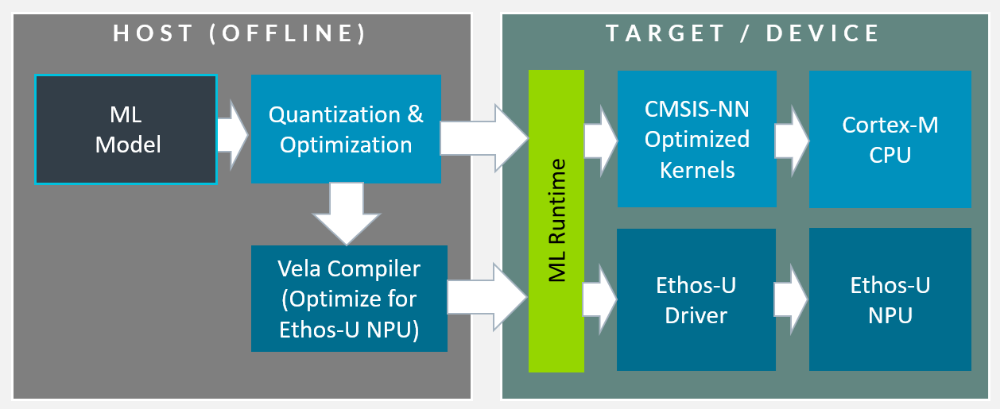
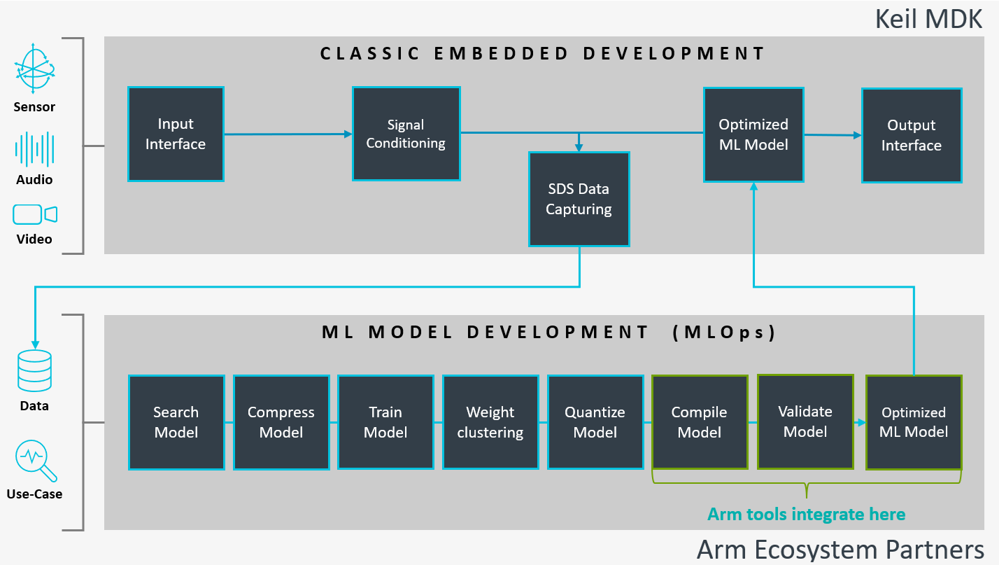

[**Arm Examples**](https://github.com/Arm-Examples/) » **Edge AI**

# Edge AI (Machine Learning)

Arm offers comprehensive tool and software support for Edge AI development on the Cortex-M processor family and Ethos-U NPU series. Simple machine learning algorithms even execute on an ultra-low-power Cortex-M0+ device while the Cortex-M52/55/85 processors with Helium vector extension are optimized for neural networks. Combining a Cortex-M processor with an Ethos-U NPU delivers up to 480 times performance uplift for ML workloads while maintaining minimal power consumption.

## ML Frameworks for Cortex-M and Ethos-U

The Arm software and tool ecosystem integrates seamlessly with popular ML frameworks including LiteRT (formerly TensorFlow Lite) and ExecuTorch (PyTorch-based).

[")](https://www.keil.arm.com/packs/tensorflow-lite-micro-tensorflow)

The **[LiteRT (TensorFlow Lite Runtime)](https://www.keil.arm.com/packs/tensorflow-lite-micro-tensorflow)** is a production-grade inference runtime optimized for Cortex-M microcontrollers, optionally with Ethos-U.

- Proven for Cortex-M only and Cortex-M + Ethos-U​
- Optimized kernels for constrained memory​
- Stable operator coverage for classic ML models ​
- Strong ecosystem, ready today​

Explore the [LiteRT software pack for Arm Cortex-M](https://github.com/MDK-Packs/tensorflow-pack) with ready-to-use workflow templates and examples.

[")](https://github.com/Arm-Examples/CMSIS-Executorch)

The **ExecuTorch (Lightweight PyTorch Runtime)** is today the dominant framework in research, making new ML model development and sharing easier.

- Strong for LLMs, vision, multimodal, generative AI
- ML developer friendly with modern tooling
- Rapidly growing eco-system momentum
- Now maturing for Cortex-M + Ethos-U targets

Get started with [CMSIS-Executorch](https://github.com/Arm-Examples/CMSIS-Executorch) for PyTorch-based AI models on Cortex-M and Ethos-U targets.

## ML Runtime System

ML models from ecosystem partners or open-source model zoos such as Hugging Face are quantized and optimized for embedded deployment. CMSIS-NN executes these optimized models on Cortex-M processors. For Ethos-U NPU targets, Vela converts model operations for NPU acceleration, while operations that cannot be converted continue to run on Cortex-M via CMSIS-NN.

Using these workflows developers can deploy trained models from PyTorch, TensorFlow, and other frameworks onto Arm targets with optimal performance and energy efficiency, enabling intelligent capabilities in IoT devices, wearables, industrial sensors, and other edge computing applications.

The [Vela compiler](https://pypi.org/project/ethos-u-vela/) provides detailed information on optimization output, diagnostics, and performance timing analysis for Ethos-U NPU targets.

## Embedded Development Workflow

The embedded development workflow for Edge AI applications requires training data for ML model training that executes on a host or MLOps system. Once trained, the ML model is deployed to the embedded target as described above. [Keil MDK](https://www.keil.arm.com/keil-mdk/) provides all tools that are required to develop and integrate the optimized ML models with the application code, device drivers, RTOS, and middleware components. Vela, Arm Compiler and FVP simulation models (the MLOps backend tools) are provided via Docker containers and CMSIS-ExecuTorch that includes also the runtime system.

The [SDS-Framework](https://www.keil.arm.com/packs/sds-arm) is a workbench for ML model development. You may capture and record real-world sensor, audio, or video data streams directly from your target hardware for ML model training. SDS enables data playback and validation of the ML model output against performance indicators. The option to run tests on hardware or FVP simulation models enables automated testing and CI/MLOps workflows without requiring physical target hardware at every step.

Discover [Arm's ML ecosystem partners](https://www.arm.com/partners/ai-and-ml) offering optimized models, tools, and solutions for edge AI applications.

## More Edge AI Developer Resources

- [CMSIS-NN](https://github.com/ARM-software/CMSIS-NN) - Optimized neural network kernels for Cortex-M processors
- [TensorFlow Runtime System](https://www.keil.arm.com/packs/tensorflow-lite-micro-tensorflow) - LiteRT software pack with examples and integration support
- [ML Evaluation Kit (MLEK)](https://www.keil.arm.com/packs/arm-mlek-arm) - Pre-configured ML projects and template applications for microcontroller targets
- [SDS-Framework](https://github.com/ARM-software/SDS-Framework) - Workbench for capturing sensor data, validating ML models, and enabling CI/MLOps workflows
- [CMSIS-Executorch](https://github.com/Arm-Examples/CMSIS-Executorch) - ExecuTorch integration for Cortex-M and Ethos-U targets
- [CMSIS-Zephyr-Executorch](https://github.com/Arm-Examples/CMSIS-Zephyr-Executorch) - ExecuTorch integration for Zephyr RTOS applications
