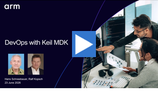

# Examples for Embedded Developers

Arm-Examples show the usage of Arm technology on various platforms. 

## Find a Repository

- [Browse all repositories](https://github.com/orgs/Arm-Examples/repositories?q=archived%3Afalse)
- [Recently updated repositories](https://github.com/orgs/Arm-Examples/repositories?sort=updated&?q=archived%3Afalse)
- [Popular repositories (most stars)](https://github.com/orgs/Arm-Examples/repositories?sort=stargazers&?q=archived%3Afalse)
- Click on "Most used topics" (Desktop Webside only)

## Featured Examples for Keil MDK

The examples below are ready-to-run embedded projects for [Keil MDK](https://www.keil.arm.com/) showcasing RTOS, machine learning, functional safety, and CI/CD automation across diverse Arm-based hardware platforms.

These examples leverage Keil Studio, CMSIS-Toolbox, and Arm FVP models with various compilers (Arm Compiler 6, GCC, LLVM) enabling both desktop and cloud-based CI/CD workflows with physical hardware and simulation models.

Keil Studio is Arm's new IDE for embedded development directly in Visual Studio Code and the successor to the µVision IDE. **[Watch this video to learn more...](https://armkeil.blob.core.windows.net/developer/Files/videos/KeilStudio/20250715_Introduction_to_Keil_Studio.mp4 "Introduction to Keil Studio")**

 

### RTOS Applications

Keil Studio is designed for all types of embedded projects, ranging from bare-metal firmware to complex RTOS-based systems. [**Learn how to choose the right option:**](BareMetal2RTOS.md "Bare-Metal or RTOS") bare-metal, Keil RTX, FreeRTOS, or Zephyr?

| Example | Hardware | Content |
|:--------|:---------|:--------|
| [Hello_World](https://github.com/Arm-Examples/Hello_World) | Various | Setup of [bare-metal or RTOS](BareMetal2RTOS.md "Bare-Metal or RTOS") configuration with [serial I/O retargeting](Serial.md "Serial I/O Messages"); prints "Hello World ..". |
| [Middleware_USB_FS](https://github.com/Arm-Examples/Middleware_USB_FS) |  STM32F7 | MDK-Middleware with USB Device and File System for evaluation kits or custom hardware. Retargeting to a different board only requires a layer with compatible APIs. [Watch the related webinar](https://armkeil.blob.core.windows.net/developer/Files/videos/KeilStudio/20250729_Working_with_STM32_devices.mp4). |
| [AWS_MQTT_Demo](https://github.com/Arm-Examples/AWS_MQTT_Demo) | Various | Connects to AWS MQTT broker using TLS with mutual authentication and demonstrates the MQTT subscribe-publish workflow. |
| [CMSIS-Zephyr](https://github.com/Arm-Examples/CMSIS-Zephyr) | Various | Zephyr application examples with Keil Studio demonstrate multi-target and debug setup. |

### Edge AI and Machine Learning

Arm offers for Edge AI development on the Cortex-M processor family and Ethos-U NPU series comprehensive tool and software support. 

**[Watch this video](https://armkeil.blob.core.windows.net/developer/Files/videos/KeilStudio/20250812_Multicore_Alif.mp4?#t=07:22 "Development flow for optimized Edge AI devices")**, explore the projects below or read the section [**Edge AI**](EdgeAI.md) to learn more.

 

| Example | Hardware | Content |
|:--------|:---------|:--------|
| [CMSIS-MLEK-Examples](https://github.com/Arm-Examples/cmsis-mlek-examples) | Alif Ensemble E7 |  Pre-configured machine learning (ML) projects using the ML Embedded Evaluation Kit. [Watch the related webinar](https://armkeil.blob.core.windows.net/developer/Files/videos/KeilStudio/20250812_Multicore_Alif.mp4). |
| [SDS-Examples](https://github.com/Arm-Examples/SDS-Examples) | Various | Examples showing the usage of the Synchronous Data Streaming (SDS) Framework. [Watch the related webinar](https://armkeil.blob.core.windows.net/developer/Files/videos/KeilStudio/20250916_SDS_Webinar.mp4). |
| [ModelNova](https://github.com/Arm-Examples/ModelNova) | Alif Ensemble E8, Ethos-U | Build Edge AI applications for Cortex-M/Ethos-U using Keil Studio, ModelNova Fusion Studio, and SDS-Framework.

### Functional Safety (FuSa RTS)

The [MDK Professional Edition](https://www.keil.arm.com/keil-mdk/#mdk-v6-editions) includes safety features that help developers achieve compliance with standards like ISO 26262 (Automotive), IEC 61508 (Industrial), and IEC 62304 (Medical). It includes the [Arm Compiler for Embedded FuSa](https://developer.arm.com/Tools%20and%20Software/Arm%20Compiler%20for%20Embedded%20FuSa) and the [Arm FuSa Run-Time System](https://developer.arm.com/Tools%20and%20Software/Keil%20MDK/FuSa%20Run-Time%20System).

**[Watch this video](https://armkeil.blob.core.windows.net/developer/Files/videos/KeilStudio/20250930_FuSa_TRAVEO.mp4?#t=01:35 "Software development for safety critical applications")**, explore the projects below or read the section [**Functional Safety**](FuSa.md) to learn more.

| Example | Hardware |  Content |
|:--------|:---------|:---------|
| [Safety-Example-Infineon-T2G](https://github.com/Arm-Examples/Safety-Example-Infineon-T2G) | Infineon Traveo T2G (Cortex-M7)| [Fusa RTS](https://developer.arm.com/Tools%20and%20Software/Keil%20MDK/FuSa%20Run-Time%20System) traffic light example, CMSIS-Driver development and verification. [Watch the related webinar](https://armkeil.blob.core.windows.net/developer/Files/videos/KeilStudio/20250930_FuSa_TRAVEO.mp4). |
| [Safety-Example-STM32](https://github.com/Arm-Examples/Safety-Example-STM32) | STM32H5 (Cortex-M33) | [Fusa RTS](https://developer.arm.com/Tools%20and%20Software/Keil%20MDK/FuSa%20Run-Time%20System) traffic light example. [Watch the related webinar](https://armkeil.blob.core.windows.net/developer/Files/videos/KeilStudio/20250930_FuSa_TRAVEO.mp4). |

### CI/CD Automation and DevOps

Discover how DevOps improves embedded systems with Arm Keil MDK. Explore build testing, hardware-in-the-loop simulation, and ML/DSP regression testing.

**[Watch this video](https://armkeil.blob.core.windows.net/developer/Files/videos/KeilStudio/DevOps_With_Keil_MDK_Webinar.mp4 "DevOps with Keil MDK")**, explore [projects with topic "cicd"](https://github.com/search?q=topic%3Acicd+org%3AArm-Examples+fork%3Atrue&type=repositories) or read the section **[CI/CD](CICD.md)** to learn more.

 

| Example | Hardware | Content  |
|:--------|:---------|:---------|
| [AVH_CI_Template](https://github.com/Arm-Examples/AVH_CI_Template) | FVP_MPS2_Cortex-M3 | CI Template for unit test automation |
| [AWS_MQTT_Demo](https://github.com/Arm-Examples/AWS_MQTT_Demo) | Multiple FVP simulation models | Integration test on simulator. |
| [CMSIS-Zephyr](https://github.com/Arm-Examples/CMSIS-Zephyr) | Real target hardware  | Integration test on hardware. |
| [ModelNova](https://github.com/Arm-Examples/ModelNova) | Self-hosted runner  | Integration test with data streaming on hardware and simulation. |

## Related

<!-- todo - Software Packs maintained by Arm -->
- [Keil Studio Documentation](https://mdk-packs.github.io/vscode-cmsis-solution-docs/)
- [CMSIS-Toolbox Documentation](https://open-cmsis-pack.github.io/cmsis-toolbox/)
