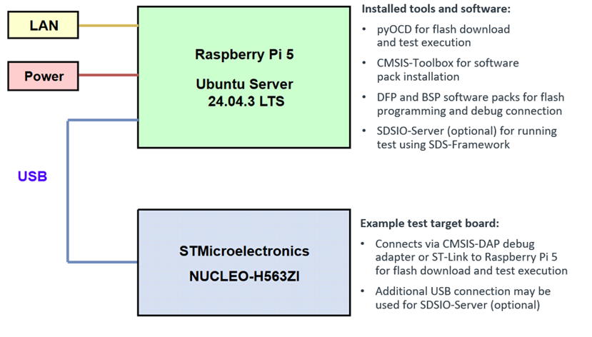

# Setup Self-Hosted GitHub Runner on Raspberry Pi 5



<br clear="left"/>

This is a step-by-step guide for the configuration of a Raspberry Pi 5 that runs GitHub Actions for test execution on hardware targets.

- [Setup Self-Hosted GitHub Runner on Raspberry Pi 5](#setup-self-hosted-github-runner-on-raspberry-pi-5)
  - [1. Flash Ubuntu to microSD](#1-flash-ubuntu-to-microsd)
  - [2. First boot and updates](#2-first-boot-and-updates)
  - [3. Register MAC on corporate network](#3-register-mac-on-corporate-network)
  - [4. Find IP address](#4-find-ip-address)
  - [5. Connect with SSH from remote computer](#5-connect-with-ssh-from-remote-computer)
  - [6. Install tools and packs](#6-install-tools-and-packs)
  - [7. Add self-hosted runner](#7-add-self-hosted-runner)
  - [8. Autostart runner (systemd)](#8-autostart-runner-systemd)

## 1. Flash Ubuntu to microSD

Use **Raspberry Pi Imager** to flash (image) Ubuntu Server onto a microSD card.

- Download Raspberry Pi Imager: [raspberrypi.com/software](https://www.raspberrypi.com/software/)
- Documentation: [Imager install documentation](https://www.raspberrypi.com/documentation/computers/getting-started.html#imager-install)

Before you start:

- Download and install Raspberry Pi Imager on a computer with a microSD card reader.
- Insert the microSD card you’ll use with the Raspberry Pi.
- Start Raspberry Pi Imager.

Use the following settings with the Raspberry Pi Imager:

- **Device**: Raspberry Pi 5
- **OS**: Other general-purpose OS → Ubuntu → Ubuntu Server 24.04.3 LTS (64-bit)
- **Storage**: Your microSD card (example: Generic STORAGE DEVICE USB Device)
- **Customization**:
    - Enter a unique hostname, for example: `rpi-ci`
    - Set locale, time zone, and keyboard layout
    - Configure username and password (example: username `devuser`, password `devuser`)
    - If the Raspberry Pi is connected via LAN, no Wi-Fi configuration is required
    - SSH authentication: enable SSH access. For simplicity, use password authentication (default).
- **Write image**: It summarizes the configuration and lets you confirm the image setup.

> [!CAUTION]
> Selecting a storage device and writing the image will erase the contents of the microSD card.

## 2. First boot and updates

1. **Power up the Raspberry Pi**
    - Insert the microSD.
    - Connect the Raspberry Pi to the monitor, keyboard, mouse and LAN.
    - Power on the Raspberry Pi.

2. **Boot messages**
    - Top left corner: `Ubuntu 24.04.3 LTS rpi-ci tty1`
    - The boot process takes a long time during the initial setup because Ubuntu performs several initializations.
    - If you see no progress, press **Enter**.

3. **Login**
    Prompt: `devuser@rpi-ci`. Log in with username `devuser` and password `devuser`.

4. **Welcome screen**

    ```text
    Welcome to Ubuntu 24.04.3 LTS (GNU/Linux 6.8.0-1031-raspi aarch64)
    :::::
    IPv4 address for eth0: 10.41.0.178
    :::::
    74 updates can be applied immediately.
    ```

    - The assigned IP address is use to connect to the Raspberry Pi using SSH from your host computer (see section 5).

5. **Apply available updates** (this may take some time)

    ```bash
    sudo apt update        # Fetches the list of available updates
    sudo apt upgrade       # Installs some updates; does not remove packages
    sudo apt full-upgrade  # Installs updates; may also remove some packages, if needed
    sudo apt autoremove    # Removes any old packages that are no longer needed
    ```

## 3. Register MAC on corporate network

Some corporate networks require **device registration** (often MAC address whitelisting) before a new device can get network access.

1. Check your corporate IT/network onboarding process.
   - Look for a device registration portal, NAC onboarding page, or a helpdesk workflow.

2. Find the LAN MAC address of your Raspberry Pi 5 with:

   ```bash
   ip a
   ```

   In the `eth0` section, the value after `link/ether`, e.g., `88:A2:9E:49:E6:CB` is the LAN (Ethernet) MAC address of your Raspberry Pi 5.

3. Register the Raspberry Pi's **Ethernet MAC address** (from Section 3) in your corporate system.
   - Typical fields are:
     - Device name: `rsp-p5-01` (example)
     - Device ID / MAC: `88:A2:9E:49:E6:CB` (example)
     - Description: Raspberry Pi 5 (runner)

4. Wait for approval/propagation (if applicable), then reconnect the Ethernet cable and continue with the next section.

## 4. Find IP address

1. Connect to your Raspberry Pi with keyboard, mouse, LAN cable, and a monitor.
    - The Raspberry Pi is assigned an IP address.
2. Type:

    ```bash
    ip a
    ```

    The value behind `eth0`, e.g. `10.41.0.178` is the assigned IP address that is used in section 5.

## 5. Connect with SSH from remote computer

1. On a Windows PC, open PowerShell and type (refer to SSH setup for other host operating systems):

    ```powershell
    ssh devuser@10.41.0.178
    ```

2. Enter password: `devuser` to complete the connection.

## 6. Install tools and packs

1. Update and install build tools and other software

    ```bash
    sudo apt update
    sudo apt upgrade
    sudo apt install cmake ninja-build -y
    sudo apt install unzip -y
    ```

2. Download and install CMSIS-Toolbox

    ```bash
    wget https://artifacts.tools.arm.com/cmsis-toolbox/2.14.1/cmsis-toolbox-linux-arm64.tar.gz
    tar -xf cmsis-toolbox-linux-arm64.tar.gz
    ```

3. Download and install pyOCD

    ```bash
    wget https://github.com/pyocd/pyOCD/releases/download/v0.44.1/pyocd-linux-arm64-0.44.1.zip
    mkdir pyocd && cd pyocd
    unzip ./../pyocd-linux-arm64-0.44.1.zip
    cd ..
    ```

4. Set up environment variables

    ```bash
    export PATH="$HOME/pyocd:$PATH"
    export CMSIS_TOOLBOX_ROOT="$HOME/cmsis-toolbox-linux-arm64"
    export PATH="$CMSIS_TOOLBOX_ROOT/bin:$PATH"
    export CMSIS_PACK_ROOT="$HOME/packs"
    ```

    **IMPORTANT:** Make paths available after a reboot of the Raspberry Pi hardware with:

    ```bash
    echo 'export PATH="$HOME/pyocd:$PATH"' >> ~/.bashrc
    echo 'export CMSIS_TOOLBOX_ROOT="$HOME/cmsis-toolbox-linux-arm64"' >> ~/.bashrc
    echo 'export PATH="$CMSIS_TOOLBOX_ROOT/bin:$PATH"' >> ~/.bashrc
    echo 'export CMSIS_PACK_ROOT="$HOME/packs"' >> ~/.bashrc
    ```

    **TIP:** Sanity check `pyOCD` and `cpackget` installation and version numbers:

    ```bash
    pyocd --version            # expected version 0.44.1 or higher
    cpackget --version         # expected version 2.2.1 or higher
    ```

5. Install required software packs

    Install the BSP and DFP software packs for your target hardware. The [`*.cbuild-run.yml`](https://open-cmsis-pack.github.io/cmsis-toolbox/YML-CBuild-Format/#run-and-debug-management) file of your application lists this information. Alternatively, use [www.keil.arm.com/packs](https://www.keil.arm.com/packs) to discover this information. For the NUCLEO-H563ZI, these packs are required:

    ```bash
    cpackget add Keil::NUCLEO-H563ZI_BSP@1.1.1
    cpackget add Keil::STM32H5xx_DFP@2.2.0
    ```

    **NOTE:** This is a one-time installation that depends on the target hardware connected to the Raspberry Pi 5.

6. Install udev rules (required for USB access)

    The udev rules control how USB devices are detected and what permissions they get. The following examples show typical setups:

    ```bash
    # ---- STLINK V3 ----
    sudo wget https://raw.githubusercontent.com/pyocd/pyOCD/main/udev/49-stlinkv3.rules -O /etc/udev/rules.d/49-stlinkv3.rules

    # ---- CMSIS-DAP ----
    sudo wget https://raw.githubusercontent.com/pyocd/pyOCD/main/udev/50-cmsis-dap.rules -O /etc/udev/rules.d/50-cmsis-dap.rules

    # ---- KitProg3 CMSIS-DAP (Cypress) ----
    sudo tee -a /etc/udev/rules.d/99-kitprog3.rules > /dev/null << 'EOF'
    # KitProg3 CMSIS-DAP (Cypress) - allow runner user access
    SUBSYSTEM=="usb", ATTR{idVendor}=="04b4", ATTR{idProduct}=="f155", MODE="0666", GROUP="plugdev"
    EOF

    # ---- Keil USB SDSIO Client ----
    sudo tee -a /etc/udev/rules.d/99-sdsio-client.rules > /dev/null << 'EOF'
    # c251:8007 Keil USB SDSIO Client
    SUBSYSTEM=="usb", ATTR{idVendor}=="c251", ATTR{idProduct}=="8007", MODE="0666"
    EOF
    ```

7. Reload udev so the new rules take effect:

    ```bash
    sudo udevadm control --reload-rules
    sudo udevadm trigger
    ```

8. Ensure plugdev group

    Add your user to `plugdev` for USB device access:

    ```bash
    sudo groupadd -f plugdev
    sudo usermod -aG plugdev $USER
    ```

9. Connect the target hardware to Raspberry Pi 5 and verify the debug adapter connection using the `pyOCD list` command. In this example, two debug adapters are connected. Use the Unique ID with the pyOCD option `--uid` to select a specific probe.

   ```bash
   pyocd list

      #   Probe/Board                                Unique ID                  Target
    ---------------------------------------------------------------------------------------------
      0   KEIL - Tools By ARM Keil ULINKplus         L96807771A                 n/a

      1   STLINK-V3                                  001700054142501320353451   stm32h563zitx NUCLEO-H563ZI
   ```

<!---
this needs rework once the SDSIO-Server is available.
1. **Install the SDS-Framework on the Raspberry Pi**

    ℹ You need the SDS-Framework/utilities for an application in the CMSIS-Zephyr repository.

    ```bash
    # 0) Go to the home directory
    cd ~

    # 1) Clone repo without checking out files
    git clone --no-checkout https://github.com/ARM-software/SDS-Framework.git
    cd SDS-Framework

    # 2) Enable sparse checkout
    git sparse-checkout init --cone

    # 3) Select only the folder you want
    git sparse-checkout set utilities

    # 4) Checkout files
    git checkout main
    ```

    The following directory structure in home is expected (simplified):

    ```text
    devuser@rpi-ci:~
    .
    ├── Downloads/
    ├── SDS-Framework/
    ├── actions-runner/
    ├── cmsis-toolbox-linux-arm64/
    ├── pyocd/
    └── python
    ```

    Detailed view of the SDS-Framework directory:

    ```text
    SDS-Framework/
    ├── ARM.SDS.pdsc
    ├── LICENSE
    ├── README.md
    ├── gen_pack.sh
    ├── mkdocs.yml
    └── utilities
         ├── 99-sdsio-client.rules
         ├── README.md
         ├── requirements.txt
         ├── sds-check.py
         ├── sds-convert.py
         ├── sds-view.py
         ├── sdsio-server.log
         └── sdsio-server.py
    ```
-->

## 7. Add self-hosted runner

Use GitHub’s official documentation for the most up-to-date steps:

- [About self-hosted runners](https://docs.github.com/en/actions/hosting-your-own-runners/about-self-hosted-runners)
- [Adding self-hosted runners](https://docs.github.com/en/actions/hosting-your-own-runners/managing-self-hosted-runners/adding-self-hosted-runners)

High-level flow (GitHub UI will generate the exact commands and a time-limited token):

1. Decide where to add the runner: repository, organization, or enterprise.
2. In GitHub, go to **Settings** → **Actions** → **Runners**.
3. Click **New self-hosted runner** and select OS/architecture.
4. On the Raspberry Pi, run the **Download**, **Configure**, and **Run** commands shown by GitHub.
5. Verify the runner shows as **Idle** on the Runners page.

## 8. Autostart runner (systemd)

It is recommended to use the GitHub `svc.sh` helper that is created after you add/configure the runner on the Raspberry Pi 5. Refer to [Configuring the self-hosted runner application as a service](https://docs.github.com/en/actions/hosting-your-own-runners/managing-self-hosted-runners/configuring-the-self-hosted-runner-application-as-a-service).

1. Open a shell **in the directory where you installed the runner** (the folder that contains `config.sh`).
2. If the runner is currently running interactively, stop it.
3. Install and start the service:

   ```bash
   sudo ./svc.sh install
   sudo ./svc.sh start
   ```

4. Check status:

   ```bash
   sudo ./svc.sh status
   ```

> [!NOTE]
> If you need a custom `systemd` unit, GitHub recommends invoking the runner via `runsvc.sh` and using the service template under `bin/` in the runner directory.

<!---
This needs rework
## 10. Workflows using rsp-p5-01

The following workflows inside the Arm-Examples are using the self-hosted runner rsp-p5-01.

1. **STMicroelectronics NUCLEO-H563ZI**
    - https://github.com/Arm-Examples/Safety-Example-STM32/actions/workflows/Run_NUCLEO_H563ZI_Release.yml
    - Organization: https://github.com/Arm-Examples/
    - Repository: Safety-Example-STM32
    - Workflow: Run_NUCLEO_H563ZI_Release.yml
    - Farm-Board: NUCLEO_H563ZI

2. **Infineon Kit T2G-B-H_Lite**
    - https://github.com/Arm-Examples/Safety-Example-Infineon-T2G/actions/workflows/Run_CMSIS_DV.yaml
    - Organization: https://github.com/Arm-Examples/
    - Repository: Safety-Example-Infineon-T2G
    - Workflow: Run_CMSIS_DV.yaml
    - Farm-Board: KIT_T2G-B-H_LITE REV-01

3. **Alif DevKit-E8**
    - https://github.com/Arm-Examples/ModelNova/actions/workflows/HIL_RPS_AppKit-E8.yml
    - Organization: https://github.com/Arm-Examples/
    - Repository: ModelNova
    - Workflow: HIL_RPS_AppKit-E8.yml
    - Farm-Board: ALIF DK-E8 (Development Kit Ensemble E8 Series)

4. **CMSIS-Zephyr**
    - https://github.com/Arm-Examples/CMSIS-Zephyr/blob/main/.github/workflows/Run_NUCLEO-H563ZI.yaml
    - Organization: https://github.com/Arm-Examples/
    - Repository: CMSIS-Zephyr
    - Workflow: Run_NUCLEO-H563ZI.yaml
    - Farm-Board: NUCLEO_H563ZI

## 11. Runner directory layout

ℹ These workflows has expanded the previous directory structure as follow:

i.e. the directories ModelNova, Safety-Example-Infineon-T2G, Safety-Example-STM32, and CMSIS-Zephyr have been added
to the actions-runner/Arm-Examples/_work/ folder.

```text
~/actions-runner/Arm-Examples/_work/
    .
    ├── ModelNova/
    ├── Safety-Example-Infineon-T2G/
    ├── Safety-Example-STM32/
    ├── CMSIS-Zephyr/
    │
    ├── _PipelineMapping/
    ├── _actions/
    ├── _temp/
    ├── _tool/
    ├── _update/
    └── _update.sh
```

ℹ A more detailed representation of the directory structure generated by the execution of the HIL_RPS_AppKit-E8.yml workflow:

```text
~/actions-runner/Arm-Examples/_work/ModelNova/
    .
    └── ModelNova
            ├── Documentation
            │   └── image/
            ├── RockPaperScissors
            │   ├── AppKit-E8_USB
            │   │   ├── Board/
            │   │   ├── ai_layer/
            │   │   ├── algorithm/
            │   │   │
            │   │   ├── out
            │   │   │   ├── AlgorithmTest
            │   │   │   │   └── AppKit-E8-U85
            │   │   │   │       └── DebugPlay
            │   │   │   │           ├── AlgorithmTest.DebugPlay+AppKit-E8-U85.cbuild.yml
            │   │   │   │           ├── AlgorithmTest.axf
            │   │   │   │           ├── AlgorithmTest.axf.map
            │   │   │   │           ├── AlgorithmTest.hex
            │   │   │   │           └── compile_commands.json
            │   │   │   └── SDS+AppKit-E8-U85.cbuild-run.yml
            │   │   │
            │   │   └── sdsio/
            │   ├── RPS_cls_dataset/
            │   └── SDS_Metadata/
            └── packs
                    └── PyTorch.ExecuTorch.1.1.0-rc1-build.12
                            ├── Documentation/
                            ├── generated_test/
                            ├── include/
                            ├── meta/
                            └── src/
```

ℹ A more detailed representation of the directory structure generated by the execution of the Run_NUCLEO-H563ZI.yaml workflow:

```text
~/actions-runner/Arm-Examples/_work/CMSIS-Zephyr/
    .
    └── CMSIS-Zephyr
            ├── LICENSE
            ├── README.md
            ├── blinky
            ├── images
            │
            ├── out
            │   ├── blinky
            │   │   └── NUCLEO-H563ZI
            │   │       └── Debug-RTT
            │   │           ├── CMakeFiles
            │   │           ├── Kconfig
            │   │           ├── app
            │   │           ├── modules
            │   │           └── zephyr
            │   ├── zephyr+NUCLEO-H563ZI.cbuild-run.yml
            │   └── zephyr+NUCLEO-H563ZI.SVDat
            │
            ├── threads
            ├── vcpkg-configuration.json
            └── zephyr.csolution.yml
```

--->
